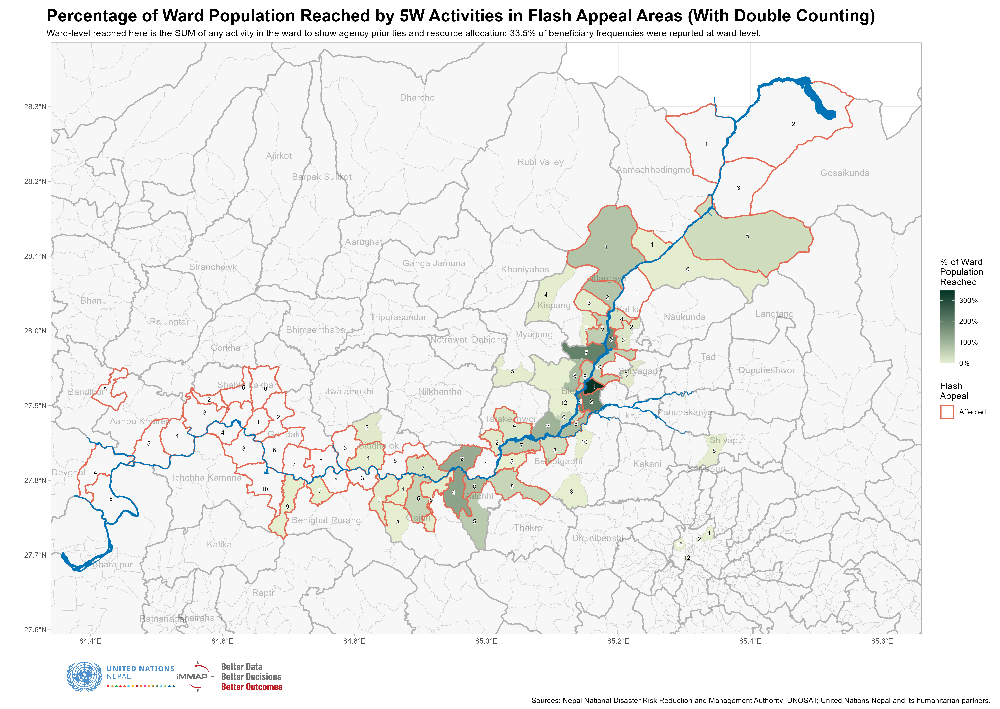

```{r setup, include=FALSE}

knitr::opts_chunk$set(echo=FALSE, fig.width=9, message = FALSE, warning=FALSE)

library(tidyverse)
library(sf)
library(readxl)
library(kableExtra)
library(flextable)
library(viridis)
library(scales)
library(janitor)
library(cowplot)
library(magick)
library(patchwork)
library(shadowtext)
library(showtext)
library(ggrepel)
library(terra)
library(tidyterra)
library(maptiles)
library(cowplot)
library(ggview)
library(flextable)
library(DT)

options(warn = -1)

# showtext_auto()

# font_add_google("Roboto", "roboto")

`%out%` <- Negate(`%in%`)

theme_set(theme_light())

options(scipen = 999)

```

```{r geodata, include=FALSE}

nepal_admin <- read_xlsx("./data/npl_admin_boundaries.xlsx", 
                         sheet = 7) |> 
  select(adm3_name, adm3_pcode, adm2_name, adm2_pcode, adm1_name, adm1_pcode)

affected_municipalities_wards <- read_xls("./data/Affected_wardsv2.xls") |> 
  janitor::clean_names() |> 
  select(adm1_pcode, 
         district = adm2_en, 
         adm2_pcode,
         municipality = adm3_en, 
         adm3_pcode, 
         ward = new_ward_n) |> 
  left_join(
    nepal_admin |> 
      distinct(adm1_name, adm1_pcode), 
    by = "adm1_pcode"
  ) |> 
  rename(province = adm1_name) |> 
  relocate(province, .before = adm1_pcode) |> 
  distinct(adm3_pcode, ward)

wards <- st_read("./data/shapefiles/npl_admn_ad4_py_s1_ocha_hp_wards.shp") |> 
  rename(ward = NEW_WARD_N) |> 
  janitor::clean_names() |> 
  mutate(district = str_to_title(district))

affected_wards <- read_xls("./data/Affected_wardsV2.xls") |> 
  janitor::clean_names()

adm3 <- st_read("./data/shapefiles/npl_admin_boundaries.shp/npl_admin3.shp")

adm2 <- st_read("./data/shapefiles/npl_admin_boundaries.shp/npl_admin2.shp")

river_buffer <- st_read("./data/shapefiles/aoi_affd_aff_py_s3_govn_pp_AOI500mBuffer.shp") 

river <- st_read("./data/shapefiles/Flood Extent Shape file/Flood extent_SHP.shp")

holding_centres <- st_read("./data/shapefiles/npl_shel_shl_pt_s3_various_pp_holding_centre.shp")

settlements <- st_read("./data/shapefiles/npl_stle_stl_pt_s0_osm_pp_settlements.shp") |> 
  clean_names() |> 
  mutate(point_size = case_when(
    fclass == "hamlet" ~ .5, 
    fclass == "village" ~ .7, 
    fclass == "suburb" ~ .9,
    fclass == "town" ~ 1.25, 
    fclass == "city" ~ 1.5, 
    fclass == "national_capital" ~ 2, 
    TRUE ~ 10
  ))

# river <- st_read("./data/shapefiles/Flood Extent.gpkg", options = "CONVERT_TO_LINEAR=YES") 

```

```{r data, include=FALSE}

municipal_damage_losses <- read_csv("./data/municipal_damage_loss.csv")

municipal_long <- municipal_damage_losses |> 
  mutate(affected_hectares_agriculture = paddy_affected_hectares + vegetables_affected_hectares, 
         total_baseline_hectares = paddy_baseline_hectares + vegetables_baseline_hectares, 
         pc_affected_hectares = affected_hectares_agriculture / total_baseline_hectares, 
         pc_affected_buildings = affected_buildings / estimated_buildings_in_damaged_corridor, 
         pc_impacted_households = impacted_households / households_in_affected_wards_census_2021) |> 
  select(adm2_pcode, adm3_pcode, impacted_households, 
         pc_impacted_households, 
         impacted_population = impacted_population_total,
         affected_buildings, pc_affected_buildings,
         affected_hectares_agriculture, pc_affected_hectares) |> 
  pivot_longer(cols = impacted_households:pc_affected_hectares, 
               names_to = "variable", 
               values_to = "value") 

consolidated_date <- "20260914"

consolidated <- read_xlsx("./data/NEPAL 5W Data Consolidation (ADMIN_ONLY) 20260917.xlsx", 
                          skip = 5, 
                          sheet = "Compiled_Data") |>
  janitor::clean_names() |> 
  mutate_at(c("province", "district", "municipality"), ~ str_to_title(.)) |> 
  mutate_at(c("province", "district", "municipality"), ~ str_trim(.)) |> 
  mutate(municipality = str_remove_all(municipality, " Gaunpalika")) |> 
  mutate(province = case_when(
    district == "Gorkha" ~ "Gandaki", 
    district == "Tanahu" ~ "Gandaki",
    TRUE ~ province
  )) |> 
  mutate(district = case_when(
    municipality == "Gosaikunda" ~ "Rasuwa", 
    municipality == "Bidur Municipality" ~ "Nuwakot", 
    TRUE ~ district
  )) |> 
  mutate(municipality = case_when(
    municipality == "Benighat" ~ "Benighat Rorang", 
    municipality == "Galchi Rural Municipality" ~ "Galchhi", 
    municipality == "Gandaki" ~ "Gandaki", 
    municipality == "Bheri Malika Municipality" ~ "Bheri Malika", 
    municipality == "Nalgad Municipality" ~ "Nalgad", 
    municipality == "Kathmandu Metropolitian City" ~ "Kathmandu", 
    municipality == "Nagarjun Municipality" ~ "Nagarjun", 
    municipality == "Belkotgadhi Municipality|Belkotgadhi Nagarpalika" ~ "Belkotgadhi", 
    str_detect(municipality, "Bidur") ~ "Bidur", 
    municipality == "Kispang Municipality" ~ "Kispang", 
    municipality == "Tarkeshwor" ~ "Tarakeshwor", 
    municipality == "Rasuwa Dao, Dhunche" ~ "Gosaikunda",
    str_detect(municipality, "Devghat") ~ "Devghat", 
    str_detect(municipality, "Gandaki") ~ "Gandaki", 
    str_detect(municipality, "Belkotgadhi") ~ "Belkotgadhi", 
    str_detect(municipality, "Langtang") ~ "Langtang",
    municipality == "Aanbukhaireni" ~ "Aanbu Khaireni",
    TRUE ~ municipality)) |> 
  left_join(
    nepal_admin |> 
      distinct(adm1_name, adm1_pcode), 
    by = c("province" = "adm1_name")
  ) |> 
  left_join(
    nepal_admin |> 
      distinct(adm1_pcode, adm2_name, adm2_pcode), 
    by = c("adm1_pcode", "district" = "adm2_name")
  ) |> 
  left_join(
    nepal_admin |> 
      distinct(adm1_pcode, adm2_pcode, 
             adm3_name, adm3_pcode), 
    by = c("adm1_pcode", "adm2_pcode", "municipality" = "adm3_name")
  ) |> 
  rename(individuals_reached = total_number_of_beneficiaries_reached_people_individuals) |> 
  filter(disaster_response_plan == "Rasuwa Flood Response")

census_flat <- cbind(
  read_csv("./data/nepal_census2021_ward_level_household_tables_bagmati_gandaki_flat.csv") |> 
    mutate(match1 = paste0(adm2_pcode, adm3_pcode, ward)),
  read_csv("./data/nepal_census2021_ward_level_individual_tables_bagmati_gandaki_flat.csv") |> 
    mutate(match2 = paste0(adm2_pcode, adm3_pcode, ward)) |> 
    select(-c(province:ward), -total_households, -rdna_affected)
)

# Using this temporarily until the population figures are resolved
differences <- read_csv("./data/differences_between_flash_appeal_and_rdna_affected_wards.csv") |> 
  mutate(match3 = paste0(adm2_pcode, adm3_pcode, ward))

damage_points <- read_xlsx("./data/Consolidated Damage.xlsx") |> 
  clean_names() |> 
  rename(x = long, y = lat)

impacted_buildings <- read_xlsx("./data/impacted_buildings.xlsx") |> 
  mutate(municipality = ifelse(municipality == "Ichcha Kamana", 
                               "Ichchha Kamana", 
                               municipality)) |> 
  left_join(
    nepal_admin |> 
      distinct(adm3_name, adm1_pcode, adm2_pcode, adm3_pcode), 
    by = c("municipality" = "adm3_name")
  ) |> 
  filter(adm3_pcode != "NP0327301" & adm3_pcode != "NP0335301")

census_working <- census_flat |> 
  mutate(improved_drinking_water = drinking_water_tap_piped_within_premises +
           drinking_water_tap_piped_outside_premises +
           drinking_water_tubewell_handpump +
           drinking_water_covered_well_kuwa, 
         no_toilet_public_toilet = toilet_no_toilet + toilet_public
           ) |>
  select(province, district, municipality, adm1_pcode:ward,
         total_households, population_total, 
         population_with_disabilities, 
         population_pc_urban, 
         house_quality_least_adequate_pc, house_quality_inadequate_pc, 
         improved_drinking_water, no_toilet_public_toilet, 
         wealth_quintile_poorest_quintile_count,
         wealth_quintile_poorest_quintile_pc, 
         wealth_quintile_poorer_quintile_pc)

wards_joined <- wards |> 
  select(-district) |> 
  left_join(
    differences |> 
      mutate(rdna = ifelse(rdna_affected == 1, "Affected", NA_character_)) |> 
      select(adm2_pcode, adm3_pcode, ward, rdna, rdna_affected, projection_2026_population_total), 
    by = c("adm2_pcode", "adm3_pcode", "ward")
  ) 

population_projections <- read_csv("./data/population_projections_2026_affected_wards_flat.csv")

ward_summary <- read_csv("./data/differences_between_flash_appeal_and_rdna_affected_wards.csv") |> 
  select(-different) |> 
  left_join(impacted_buildings |> 
      select(adm3_pcode, ward, impacted_buildings), 
    by = c("adm3_pcode", "ward")
  ) |> 
  left_join(
    read_csv("./data/nepal_census2021_ward_level_household_tables_bagmati_gandaki_flat.csv") |> 
      select(adm3_pcode, ward, 
             total_households 
             ), 
    by = c("adm3_pcode", "ward")
  ) |>
  left_join(
    consolidated |> 
    filter(response_modality != "Awareness/Advocacy") |> 
    filter(!is.na(sector)) |> 
    mutate(sector = ifelse(str_detect(sector, "Protection"), "Protection", sector), 
           sector = ifelse(str_detect(sector, "Health|Nutrition"), "Health & Nutrition", sector)) |> 
    filter(ward < 20 & individuals_reached > 0) |> 
    group_by(adm3_pcode, ward, sector) |> 
    summarise(individuals_reached = sum(individuals_reached), .groups = "drop") |> 
    pivot_wider(names_from = sector, 
                values_from = individuals_reached, 
                names_glue = "{sector}_{.value}"), 
    by = c("adm3_pcode", "ward")
  ) |> 
  clean_names() |> 
  rowwise() |> 
  mutate(num_sectors = 
           sum(!is.na(across(c(food_security_individuals_reached:logistics_individuals_reached)))), 
         num_sectors = ifelse(num_sectors == 0, NA_real_, num_sectors)) |> 
  ungroup() 

has_ward <- consolidated |> 
  filter(response_modality != "Awareness/Advocacy") |> 
  mutate(has_ward = ifelse(ward < 20 & !is.na(ward), "yes", "no")) |> 
  group_by(has_ward) |> 
  summarise(individuals_reached = sum(individuals_reached, na.rm = TRUE)) |> 
  pivot_wider(names_from = has_ward, 
              values_from = individuals_reached) |> 
  mutate(total = no + yes, 
         pc = yes / total)

affected_municipalities_17 <- read_xlsx("./data/Copy of Affected Palikas and Wards_ward_wise_population_projection 2026 (1).xlsx") |> 
  clean_names()
```


# Introduction

The response to the 2026 Nepal Floods is being implemented by 90 Agencies (including both Lead Agencies and Implementing Partners). According to the 5Ws, a total of 61,612 persons have been reached across 15 Municipalities. However, the 5Ws dashboard presents a view of the response that has been filtered to be in line with the Flash Appeal.

These are some of the key points of this report: 

-Municipal aggregations are limited utility in response planning and analysis, proving to be too gross a measure for a response along a narrow corridor. 

-There are very noticeable differences between the wards that were used to calculate the affected population and the wards identified as affected by the NDRRMA Rapid Disaster Needs Assessment. It is recommended to revise the Estimated Affected Population in the Flash Appeal. 

-Only `r round(has_ward$pc * 100, 2)`% of all beneficiary frequencies (inclusive of double counting) in the 5Ws are reported at ward level. This percentage is likely to increase as the response goes along, though significant omissions from the first week of the response will remain. 

-Numerous wards in Bidur Municipality have been saturated with aid. Wards both further upstream and downstream have received much less assistance. Downstreams (past Dhading) should be re-evaluated for inclusion in response plans.

-Affected wards in Nuwakot district have received much more comprehensive aid than other locations, with multiple sectors/Clusters present in most wards. 

<br><br><br>

# Municipal-level summary 

Municipal aggregations are of limited utility in planning and analysis of a response along a narrow damage corridor. However, a cursory glimpse at a municipal summary does yield several notable inconsistencies.

Unless otherwise stated, the population reached in the 5Ws is calculated by selecting the Highest number reached by any single activity in a given area. This is to avoid double counting. 

<br>


```{r municipal-summary-table}
affected_reached_summary_table <- consolidated |> 
  mutate(municipality = case_when(
    adm3_pcode == "NP0328410" ~ "Shivapuri Upper", 
    adm3_pcode == "NP0328596" ~ "Shivapuri Lower", 
    TRUE ~ municipality
  )) |>
  filter(response_modality != "Awareness/Advocacy") |> 
  filter(is.finite(individuals_reached)) |> 
  group_by(district, municipality, adm3_pcode) |> 
  summarise(individuals_reached = max(individuals_reached, na.rm = TRUE)) |> 
  full_join(
    affected_municipalities_17 |> 
      select(adm3_pcode, estimated_affected_population), 
    by = "adm3_pcode"
  ) |> 
    left_join(
    municipal_damage_losses |> 
     filter(!is.na(impacted_buildings)) |> 
     select(adm3_pcode, impacted_buildings), 
    by = "adm3_pcode"
  ) |>
  left_join(
    nepal_admin |> 
      distinct(adm2_name, adm3_name, adm3_pcode), 
    by = "adm3_pcode"
  ) |>
  select(district = adm2_name, municipality = adm3_name, 
         impacted_buildings, estimated_affected_population, individuals_reached) |>
  mutate(municipality = ifelse(is.na(impacted_buildings) & is.na(estimated_affected_population), 
                               "Various", 
                               municipality)) |> 
  mutate(district = ifelse(is.na(impacted_buildings) & is.na(estimated_affected_population), 
                               "Various", 
                               municipality)) |> 
  group_by(district, municipality) |> 
  summarise_at(vars(impacted_buildings, 
                    estimated_affected_population, 
                    individuals_reached), 
               ~sum(.x))  |> 
  mutate(pc_reached = ifelse(
    is.na(estimated_affected_population), 
    NA_real_, 
    round(individuals_reached / estimated_affected_population * 100, 2)
  ))

colfunc_bg <- colorRampPalette(c("#64bdea", "#e3edf6"))
colours_bg <- colfunc_bg(nrow(affected_reached_summary_table))

affected_reached_summary_table |> 
  arrange(desc(individuals_reached)) |> 
  rename(District = district, Municipality = municipality, 
         `Impacted buildings (RDNA)` = impacted_buildings, 
         `Affected Pop. (Flash Appeal)` = estimated_affected_population, 
         `People reached (5Ws)` = individuals_reached, 
         `% reached` = pc_reached) |> 
  kable(caption = "Municipal Summary of Affected Population (Flash Appeal) and Reached (5Ws)") |> 
  kable_classic(full_width = F) |> 
  kable_styling(bootstrap_options = "striped") 
 # column_spec(3, background = colours_bg) 
 # column_spec(4, background = colours_bg) |> 
 # column_spec(5, background = colours_bg) 
```

<br>

From the table above, we note that: 

-The number of impacted buildings does not align with the Estimated Affected Population. The clearest example of this would be to compare Gosaikunda and Benighat Rorang. 

-The Estimated Affected Population is several municipalities like Kalika and Aamachhodingmo is very low and has already been greatly exceeded by the 5Ws reached. 

-Multiple municipalities not in the Flash Appeal have been reached by partners. Some may be due to the presence of displaced populations (such as Kathmandu), but others such as Myagang are distant from the flooding, as can be seen from the map below. 

<br>

[](https://raw.githubusercontent.com/nepal-rasuwa-trishuli-floods-undac/nepal_floods_general/main/plots/municipal_gaps_max.png)

<br>

A revision of the Estimated Affected Population for the Flash Appeal is recommended to not only take into account the NDRRMA's Rapid Disaster Needs Assessment as well as populations who have been affected by access constraints.  

<br><br><br>


# Ward-level analysis


The ward is a more appropriate administrative level for analysis than the municipality. The municipalities of Bidur, Galchhi, Gosaikunda and Uttargaya are bisected by the Trishuli river, and without ward-level data, it is not possible to tell which side of the river activities are occurring on. 

The plot below shows the differences between the affected wards which were included in calculations of the affected population for the Flash Appeal and the wards where either household or agricultural damage was reported in the NDRRMA Rapid Disaster Needs Assessment. 

<br>

[](https://raw.githubusercontent.com/nepal-rasuwa-trishuli-floods-undac/nepal_floods_general/main/plots/affected_wards.png)

<br>
Though there is substantial overlap, as can be seen from the table below, reconciliation is still needed to allow for better response monitoring of partners' achievements in these areas. The table below uses beneficiary frequencies, which include double counting. 

<br>

```{r}
consolidated |> 
  filter(response_modality != "Awareness/Advocacy") |> 
  filter(is.finite(individuals_reached)) |> 
  filter(ward < 20) |> 
  group_by(adm3_pcode, ward) |> 
  summarise(individuals_reached = sum(individuals_reached, na.rm = TRUE), 
            .groups = "drop") |> 
  full_join(
    differences |> 
      select(adm3_pcode, ward, flash_appeal_affected, rdna_affected), 
    by = c("adm3_pcode", "ward")
  ) |> 
  replace_na(list(
    flash_appeal_affected = 0, 
    rdna_affected = 0
  )) |> filter(!is.na(individuals_reached)) |> 
  mutate(ward_category = case_when(
    flash_appeal_affected == 0 & rdna_affected == 0 ~ "Outside Both", 
    flash_appeal_affected == 0 & rdna_affected == 1 ~ "Only RDNA", 
    flash_appeal_affected == 1 & rdna_affected == 0 ~ "Only Flash Appeal", 
    flash_appeal_affected == 1 & rdna_affected == 1 ~ "Inside Both", 
    TRUE ~ NA_character_
  )) |> 
  group_by(ward_category) |> 
  summarise(individuals_reached = sum(individuals_reached)) |> 
  mutate(pc = round(individuals_reached / sum(individuals_reached) * 100, 2), 
         individuals_reached = round(individuals_reached)) |> 
  rename(`Ward category` = ward_category, 
         `Beneficiary frequencies (5Ws)` = individuals_reached, 
         `% of total` = pc) |> 
  kable(caption = "Beneficiary frequencies by type of ward") |> 
  kable_classic(full_width = F) |> 
  kable_styling(bootstrap_options = "striped") 
```


<br><br><br>


## Ward-level reporting


Only `r round(has_ward$pc * 100, 2)`% of all beneficiary frequencies in the 5Ws are reported at ward level. Whilst most partners are able to report current activities at the ward level, backfilling the achievements from the first week of the response with ward-level data has proved to be challenging: many relief commodities were provided to municipal authorities or "distributed" to warehouses in district or municipal seats and obtaining last-mile data for these will be challenging. 

Admittedly, the IM function's revision of the 5Ws to require ward-level data could have been speedier, but the limited demand for that level of operational oversight (either for external communications or for upward reporting) led to delays in decision making. 

Bearing these limitations mind, the plot below shows ward-level 5W achievements as a percentage of a ward's population; we have included the sum of all beneficiary frequencies reached without regard for double counting as it gives a more accurate picture of how agencies have allocated their resources to date. 

Immediately, anecdotal communications about the over-saturation of aid in Bidur are given weight. Additionally, affected wards upstream have been clearly prioritised; WFP itself has said that they will not respond any further downstream than Dhading. 

<br>

[](https://raw.githubusercontent.com/nepal-rasuwa-trishuli-floods-undac/nepal_floods_general/main/plots/ward_gaps_sum.png)


<br><br><br>

## Multi-sector programming 

The effects of the floods were severe and multidimensional, with numerous cascading effects. The loss of life, housing and key infrastructure have given rise to Protection, WASH, Health and Nutrition and Livelihoods needs. 

Area-based programming is key when each ward is subject to multiple, varying contextual specificities such as the severity of access constraints, rate of urbanisation, severity of flood damage and pre-existing vulnerability and poverty. 

<br>

[](https://raw.githubusercontent.com/nepal-rasuwa-trishuli-floods-undac/nepal_floods_general/main/plots/ward_sectors.png)

<br>

With reference to the plot above, there is a noted sparsity of sectors in the upper reaches of the Trishuli, especially past Kalika. But even within municipalities as well-covered as Bidur, there is a marked difference when it comes to sector/Cluster presence on the western bank of the river. 

The most prolific Cluster in terms of ward-level presence is the Protection Cluster, which is working in 29 wards. Of the 37 wards in where humanitarian partners are working, 27 have more than one Cluster present. The most common Cluster combination is between Health & Nutrition and Protection (19 wards together), followed by WASH and Protection (17 wards); though this should be noted that this is more of an indicator of intra-UNICEF coordination than concerted area-based programming. Shelter and WASH are present in 13 wards together. 


```{r eval=FALSE}

ward_summary |> 
  summarise_at(
    vars(food_security_individuals_reached:logistics_individuals_reached), 
    ~ sum(!is.na(.x))
  )

ward_summary |>
  rowwise() |> 
  mutate(wash_protection = sum(!is.na(wash_individuals_reached)) + sum(!is.na(protection_individuals_reached)), 
         health_protection = sum(!is.na(health_nutrition_individuals_reached)) + 
                                   sum(!is.na(protection_individuals_reached)), 
         shelter_wash = sum(!is.na(shelter_individuals_reached)) + 
                                   sum(!is.na(wash_individuals_reached))) |> 
  ungroup() |> 
  count(shelter_wash)
```

<br><br><br>

# Assessment coverage

```{r}
register <- read_xlsx("./data/Nepal - Assessment registry - Rasuwa Flood.xlsx", skip = 3) |> 
  setNames(c("lead_organisation", "participating_organisation", 
             "assessment", "description", "sector", 
             "province", "district", "municipality", "ward", 
             "representative_at_level", "status", "status_update", 
             "data_collection_method", "availability_report", "email_contact", 
             "permission_public", "report_link", "dashboard_link", 
             "comments"))

register |> 
  mutate(sector = str_remove_all(sector, "Protection / Child Protection|Protection / Child Protection, Protection / GBV,|Health / SRH,|Protection / GBV,|Multi-Sector")) |> 
  separate_longer_delim(sector, delim = "/") |> 
  separate_longer_delim(sector, delim = ",") |> 
  filter(sector != "") |> 
  count(sector)
  
  separate_longer_delim(province, delim = ",") |> 
  separate_longer_delim(district, delim = ",") |> 
  separate_longer_delim(municipality, delim = ",") |> 
  count(assessment, municipality, sector) |> 
  arrange(desc(n))
```

