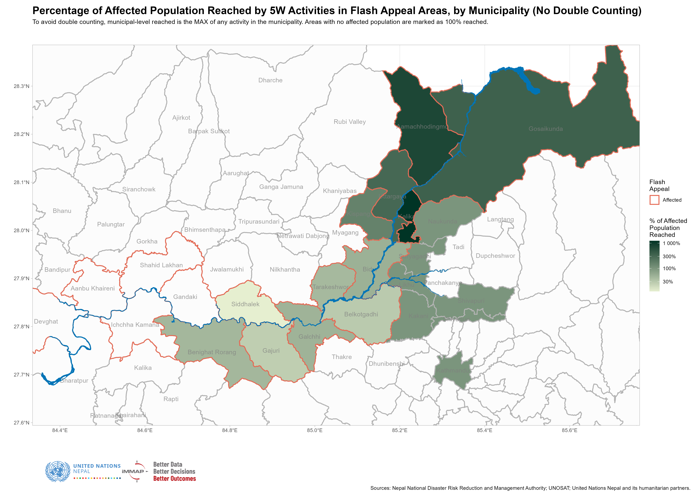
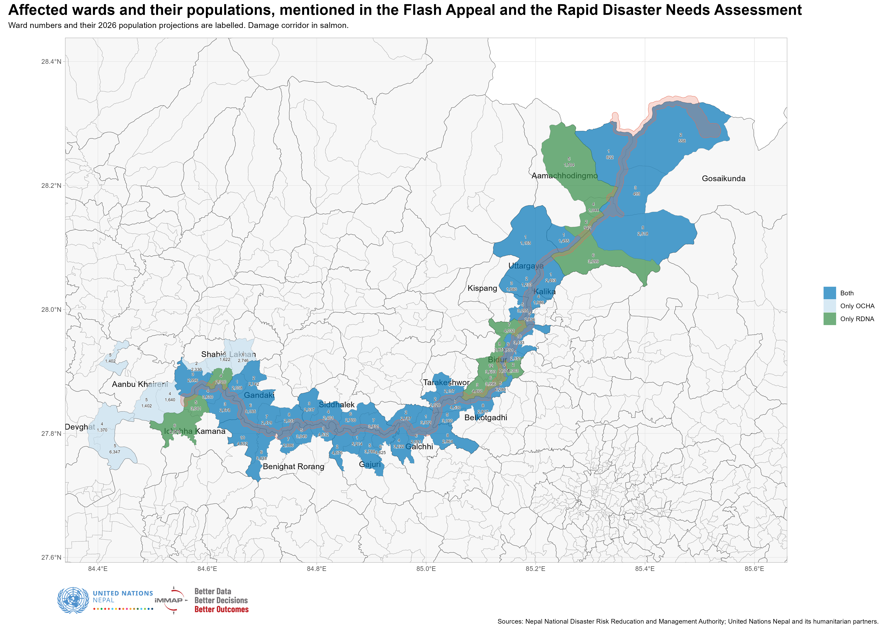
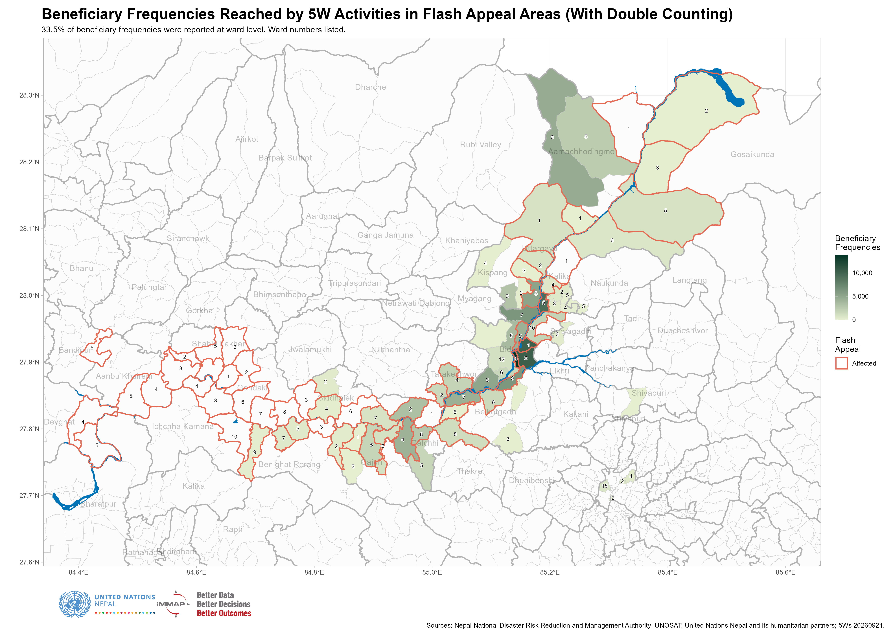
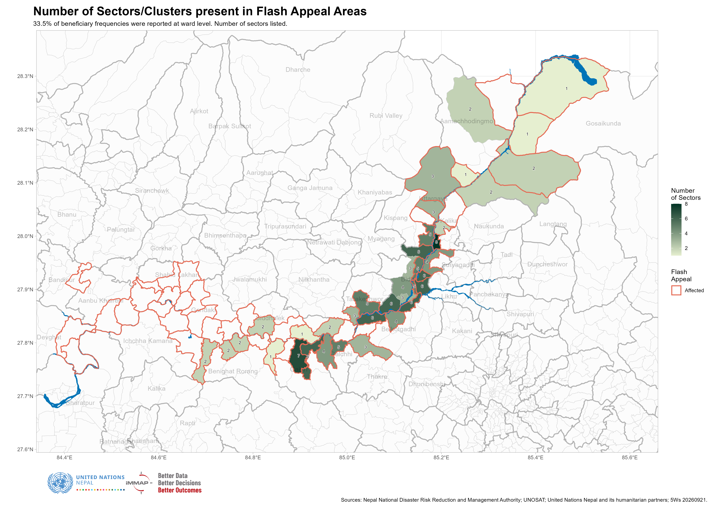
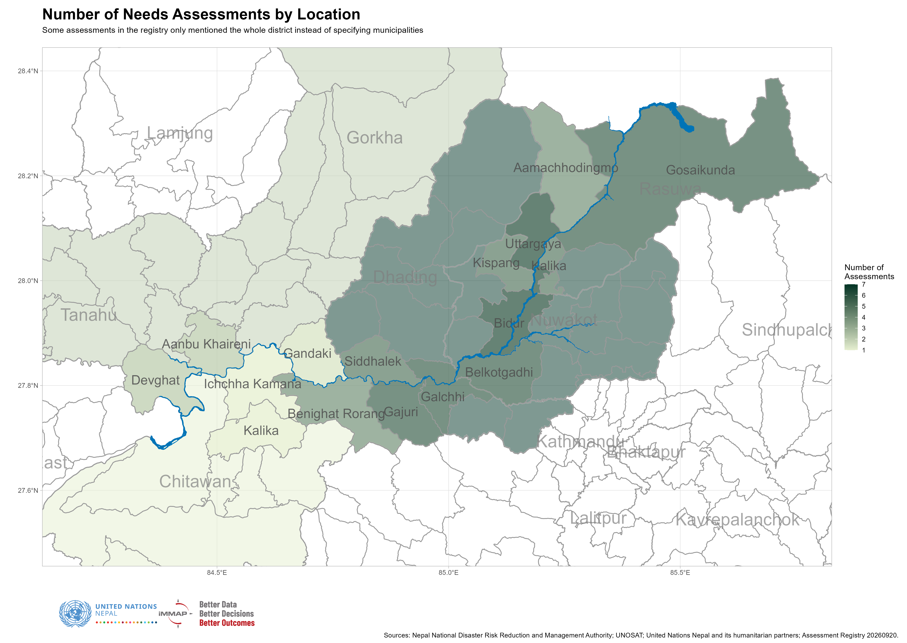
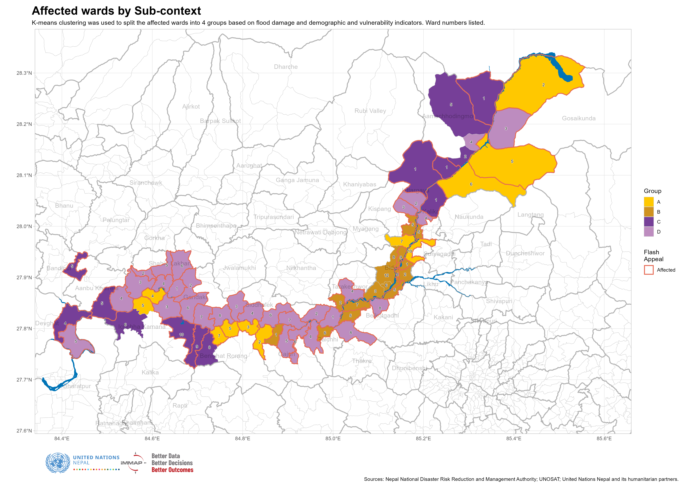

```{r setup, include=FALSE}

knitr::opts_chunk$set(echo=FALSE, fig.width=9, message = FALSE, warning=FALSE)

library(tidyverse)
library(sf)
library(readxl)
library(kableExtra)
library(flextable)
library(viridis)
library(scales)
library(janitor)
library(cowplot)
library(magick)
library(patchwork)
library(shadowtext)
library(showtext)
library(ggrepel)
library(terra)
library(tidyterra)
library(maptiles)
library(cowplot)
library(ggview)
library(flextable)
library(DT)

options(warn = -1)

# showtext_auto()

# font_add_google("Roboto", "roboto")

`%out%` <- Negate(`%in%`)

theme_set(theme_light())

options(scipen = 999)

range_wna <- function(x){(x-min(x, na.rm = TRUE))/(max(x, na.rm = TRUE)-min(x, na.rm = TRUE))}

```

```{r geodata, include=FALSE}

nepal_admin <- read_xlsx("./data/npl_admin_boundaries.xlsx", 
                         sheet = 7) |> 
  select(adm3_name, adm3_pcode, adm2_name, adm2_pcode, adm1_name, adm1_pcode)

affected_municipalities_wards <- read_xls("./data/Affected_wardsv2.xls") |> 
  janitor::clean_names() |> 
  select(adm1_pcode, 
         district = adm2_en, 
         adm2_pcode,
         municipality = adm3_en, 
         adm3_pcode, 
         ward = new_ward_n) |> 
  left_join(
    nepal_admin |> 
      distinct(adm1_name, adm1_pcode), 
    by = "adm1_pcode"
  ) |> 
  rename(province = adm1_name) |> 
  relocate(province, .before = adm1_pcode) |> 
  distinct(adm3_pcode, ward)

wards <- st_read("./data/shapefiles/npl_admn_ad4_py_s1_ocha_hp_wards.shp") |> 
  rename(ward = NEW_WARD_N) |> 
  janitor::clean_names() |> 
  mutate(district = str_to_title(district))

affected_wards <- read_xls("./data/Affected_wardsV2.xls") |> 
  janitor::clean_names()

adm3 <- st_read("./data/shapefiles/npl_admin_boundaries.shp/npl_admin3.shp")

adm2 <- st_read("./data/shapefiles/npl_admin_boundaries.shp/npl_admin2.shp")

river_buffer <- st_read("./data/shapefiles/aoi_affd_aff_py_s3_govn_pp_AOI500mBuffer.shp") 

river <- st_read("./data/shapefiles/Flood Extent Shape file/Flood extent_SHP.shp")

holding_centres <- st_read("./data/shapefiles/npl_shel_shl_pt_s3_various_pp_holding_centre.shp")

settlements <- st_read("./data/shapefiles/npl_stle_stl_pt_s0_osm_pp_settlements.shp") |> 
  clean_names() |> 
  mutate(point_size = case_when(
    fclass == "hamlet" ~ .5, 
    fclass == "village" ~ .7, 
    fclass == "suburb" ~ .9,
    fclass == "town" ~ 1.25, 
    fclass == "city" ~ 1.5, 
    fclass == "national_capital" ~ 2, 
    TRUE ~ 10
  ))

# river <- st_read("./data/shapefiles/Flood Extent.gpkg", options = "CONVERT_TO_LINEAR=YES") 

```

```{r data, include=FALSE}

municipal_damage_losses <- read_csv("./data/municipal_damage_loss.csv")

municipal_long <- municipal_damage_losses |> 
  mutate(affected_hectares_agriculture = paddy_affected_hectares + vegetables_affected_hectares, 
         total_baseline_hectares = paddy_baseline_hectares + vegetables_baseline_hectares, 
         pc_affected_hectares = affected_hectares_agriculture / total_baseline_hectares, 
         pc_affected_buildings = affected_buildings / estimated_buildings_in_damaged_corridor, 
         pc_impacted_households = impacted_households / households_in_affected_wards_census_2021) |> 
  select(adm2_pcode, adm3_pcode, impacted_households, 
         pc_impacted_households, 
         impacted_population = impacted_population_total,
         affected_buildings, pc_affected_buildings,
         affected_hectares_agriculture, pc_affected_hectares) |> 
  pivot_longer(cols = impacted_households:pc_affected_hectares, 
               names_to = "variable", 
               values_to = "value") 

consolidated_date <- "20260921"

consolidated <- read_xlsx("./data/NEPAL 5W Data Consolidation (ADMIN_ONLY)_21 Sep 2026.xlsx", 
                          skip = 5, 
                          sheet = "Compiled_Data") |>
  janitor::clean_names() |> 
  mutate_at(c("province", "district", "municipality"), ~ str_to_title(.)) |> 
  mutate_at(c("province", "district", "municipality"), ~ str_trim(.)) |> 
  mutate(municipality = str_remove_all(municipality, " Gaunpalika")) |> 
  mutate(province = case_when(
    district == "Gorkha" ~ "Gandaki", 
    district == "Tanahu" ~ "Gandaki",
    TRUE ~ province
  )) |> 
  mutate(district = case_when(
    municipality == "Gosaikunda" ~ "Rasuwa", 
    municipality == "Bidur Municipality" ~ "Nuwakot", 
    TRUE ~ district
  )) |> 
  mutate(municipality = case_when(
    municipality == "Benighat" ~ "Benighat Rorang", 
    municipality == "Galchi Rural Municipality" ~ "Galchhi", 
    municipality == "Gandaki" ~ "Gandaki", 
    municipality == "Bheri Malika Municipality" ~ "Bheri Malika", 
    municipality == "Nalgad Municipality" ~ "Nalgad", 
    municipality == "Kathmandu Metropolitian City" ~ "Kathmandu", 
    municipality == "Nagarjun Municipality" ~ "Nagarjun", 
    municipality == "Belkotgadhi Municipality|Belkotgadhi Nagarpalika" ~ "Belkotgadhi", 
    str_detect(municipality, "Bidur") ~ "Bidur", 
    municipality == "Kispang Municipality" ~ "Kispang", 
    municipality == "Tarkeshwor" ~ "Tarakeshwor", 
    municipality == "Rasuwa Dao, Dhunche" ~ "Gosaikunda",
    str_detect(municipality, "Devghat") ~ "Devghat", 
    str_detect(municipality, "Gandaki") ~ "Gandaki", 
    str_detect(municipality, "Belkotgadhi") ~ "Belkotgadhi", 
    str_detect(municipality, "Langtang") ~ "Langtang",
    municipality == "Aanbukhaireni" ~ "Aanbu Khaireni",
    TRUE ~ municipality)) |> 
  left_join(
    nepal_admin |> 
      distinct(adm1_name, adm1_pcode), 
    by = c("province" = "adm1_name")
  ) |> 
  left_join(
    nepal_admin |> 
      distinct(adm1_pcode, adm2_name, adm2_pcode), 
    by = c("adm1_pcode", "district" = "adm2_name")
  ) |> 
  left_join(
    nepal_admin |> 
      distinct(adm1_pcode, adm2_pcode, 
             adm3_name, adm3_pcode), 
    by = c("adm1_pcode", "adm2_pcode", "municipality" = "adm3_name")
  ) |> 
  rename(individuals_reached = total_number_of_beneficiaries_reached_people_individuals) |> 
  filter(disaster_response_plan == "Rasuwa Flood Response")

census_flat <- cbind(
  read_csv("./data/nepal_census2021_ward_level_household_tables_bagmati_gandaki_flat.csv") |> 
    mutate(match1 = paste0(adm2_pcode, adm3_pcode, ward)),
  read_csv("./data/nepal_census2021_ward_level_individual_tables_bagmati_gandaki_flat.csv") |> 
    mutate(match2 = paste0(adm2_pcode, adm3_pcode, ward)) |> 
    select(-c(province:ward), -total_households, -rdna_affected)
)

# Using this temporarily until the population figures are resolved
differences <- read_csv("./data/differences_between_flash_appeal_and_rdna_affected_wards.csv") |> 
  mutate(match3 = paste0(adm2_pcode, adm3_pcode, ward))

damage_points <- read_xlsx("./data/Consolidated Damage.xlsx") |> 
  clean_names() |> 
  rename(x = long, y = lat)

impacted_buildings <- read_xlsx("./data/impacted_buildings.xlsx") |> 
  mutate(municipality = ifelse(municipality == "Ichcha Kamana", 
                               "Ichchha Kamana", 
                               municipality)) |> 
  left_join(
    nepal_admin |> 
      distinct(adm3_name, adm1_pcode, adm2_pcode, adm3_pcode), 
    by = c("municipality" = "adm3_name")
  ) |> 
  filter(adm3_pcode != "NP0327301" & adm3_pcode != "NP0335301")

census_working <- census_flat |> 
  mutate(improved_drinking_water = drinking_water_tap_piped_within_premises +
           drinking_water_tap_piped_outside_premises +
           drinking_water_tubewell_handpump +
           drinking_water_covered_well_kuwa, 
         no_toilet_public_toilet = toilet_no_toilet + toilet_public
           ) |>
  select(province, district, municipality, adm1_pcode:ward,
         total_households, population_total, 
         population_with_disabilities, 
         population_pc_urban, 
         house_quality_least_adequate_pc, house_quality_inadequate_pc, 
         improved_drinking_water, no_toilet_public_toilet, 
         wealth_quintile_poorest_quintile_count,
         wealth_quintile_poorest_quintile_pc, 
         wealth_quintile_poorer_quintile_pc)

wards_joined <- wards |> 
  select(-district) |> 
  left_join(
    differences |> 
      mutate(rdna = ifelse(rdna_affected == 1, "Affected", NA_character_)) |> 
      select(adm2_pcode, adm3_pcode, ward, rdna, rdna_affected, projection_2026_population_total), 
    by = c("adm2_pcode", "adm3_pcode", "ward")
  ) 

population_projections <- read_csv("./data/population_projections_2026_affected_wards_flat.csv")

ward_summary <- read_csv("./data/differences_between_flash_appeal_and_rdna_affected_wards.csv") |> 
  select(-different) |> 
  left_join(impacted_buildings |> 
      select(adm3_pcode, ward, impacted_buildings), 
    by = c("adm3_pcode", "ward")
  ) |> 
  left_join(
    read_csv("./data/nepal_census2021_ward_level_household_tables_bagmati_gandaki_flat.csv") |> 
      select(adm3_pcode, ward, 
             total_households 
             ), 
    by = c("adm3_pcode", "ward")
  ) |>
  left_join(
    consolidated |> 
    filter(response_modality != "Awareness/Advocacy") |> 
    filter(!is.na(sector)) |> 
    mutate(sector = ifelse(str_detect(sector, "Protection"), "Protection", sector), 
           sector = ifelse(str_detect(sector, "Health|Nutrition"), "Health & Nutrition", sector)) |> 
    filter(ward < 20 & individuals_reached > 0) |> 
    group_by(adm3_pcode, ward, sector) |> 
    summarise(individuals_reached = sum(individuals_reached), .groups = "drop") |> 
    pivot_wider(names_from = sector, 
                values_from = individuals_reached, 
                names_glue = "{sector}_{.value}"), 
    by = c("adm3_pcode", "ward")
  ) |> 
  clean_names() |> 
  rowwise() |> 
  mutate(num_sectors = 
           sum(!is.na(across(c(food_security_individuals_reached:logistics_individuals_reached)))), 
         num_sectors = ifelse(num_sectors == 0, NA_real_, num_sectors)) |> 
  ungroup() 

has_ward <- consolidated |> 
  filter(response_modality != "Awareness/Advocacy") |> 
  mutate(has_ward = ifelse(ward < 20 & !is.na(ward), "yes", "no")) |> 
  group_by(has_ward) |> 
  summarise(individuals_reached = sum(individuals_reached, na.rm = TRUE)) |> 
  pivot_wider(names_from = has_ward, 
              values_from = individuals_reached) |> 
  mutate(total = no + yes, 
         pc = yes / total)

affected_municipalities_17 <- read_xlsx("./data/Copy of Affected Palikas and Wards_ward_wise_population_projection 2026 (1).xlsx") |> 
  clean_names()

register <- read_xlsx("./data/Nepal - Assessment registry - Rasuwa Flood.xlsx", skip = 3) |> 
  setNames(c("lead_organisation", "participating_organisation", 
             "assessment", "description", "sector", 
             "province", "district", "municipality", "ward", 
             "representative_at_level", "status", "status_update", 
             "data_collection_method", "availability_report", "email_contact", 
             "permission_public", "report_link", "dashboard_link", 
             "comments"))
```


# Introduction

The response to the 2026 Nepal Floods is comprised of the efforts of 58 Lead Agencies and 46 Implementing Partners. According to the 5Ws dashboard, a total of 61,612 persons have been reached across 15 Municipalities. The Flash Appeal estimated 84,720 people were affected by the flooding. However, the 5Ws dashboard presents a filtered view of the response, and is aligned with the Flash Appeal. 

## Executive summary

* Municipal aggregations are of limited utility in response planning and analysis, proving too gross a measure for a response along a narrow corridor. 

* There are noticeable differences between the wards that were used to calculate the affected population and the wards identified as affected by the NDRRMA Rapid Disaster Needs Assessment. It is recommended to revise the Flash Appeal to update the Estimated Affected Population. 

* Only `r round(has_ward$pc * 100, 2)`% of all beneficiary frequencies (inclusive of double counting) in the 5Ws are reported at ward level. This percentage is likely to increase as the response goes along, though significant omissions from the first week of the response will likely never be resolved. 

* Numerous wards in Bidur Municipality have been saturated with aid. Wards both further upstream and downstream have received much less assistance. Downstream areas (past Dhading) should be re-evaluated for inclusion in response plans.

* Affected wards in Nuwakot district have received much more comprehensive aid than other locations, with multiple sectors/Clusters present in most wards. 

* Within the core response areas of Nuwakot, Rasuwa and Dhading, there are noticeably fewer assessments planned/conducted for Aamachhodingmo, Kalika and Kispang. Assessment coverage is highest in Bidur and Uttargaya. 

* Affected wards can be broken up into 4 sub-contexts to facilitate planning and analysis: 
  + **A**: Highly-impacted, entirely rural wards with lower-than-average agricultural employment. 
  + **B**: Highly-impacted, entirely urban wards with lower-than-average agricultural employment. 
  + **C**: Less impacted, entirely rural wards which are the poorest areas across all flood-affected wards. 
  + **D**: Less impacted, entirely rural wards with high agricultural employment. 

<br><br><br>

# Municipal-level summary 

Municipal aggregations are of limited utility in planning and analysis of a response along a narrow damage corridor. However, even a cursory glimpse at municipal summaries yield several notable inconsistencies.

From the plots below, we note that: 

* The number of impacted buildings does not align with the Estimated Affected Population. An example of this would be the differences between Gosaikunda and Benighat Rorang. 

* The Estimated Affected Population is is very low in several municipalities, like Kalika and Aamachhodingmo, and has already been greatly exceeded by the 5Ws reached. 

* Multiple municipalities not in the Flash Appeal or the NDRRMA Rapid Disaster Needs Assessment have been reached by partners. Some may be due to the presence of displaced populations (such as Kathmandu), but others such as Myagang are distant from the flooding. 


<br>

```{r fig.height = 8}
consolidated |> 
  mutate(municipality = case_when(
    adm3_pcode == "NP0328410" ~ "Shivapuri Upper", 
    adm3_pcode == "NP0328596" ~ "Shivapuri Lower", 
    TRUE ~ municipality
  )) |>
  filter(response_modality != "Awareness/Advocacy") |> 
  filter(is.finite(individuals_reached)) |> 
  group_by(district, municipality, adm3_pcode) |> 
  summarise(individuals_reached = max(individuals_reached, na.rm = TRUE), 
            .groups = "drop") |> 
  full_join(
    affected_municipalities_17 |> 
      select(adm3_pcode, estimated_affected_population), 
    by = "adm3_pcode"
  ) |> 
    left_join(
    municipal_damage_losses |> 
     filter(!is.na(impacted_buildings)) |> 
     select(adm3_pcode, impacted_buildings), 
    by = "adm3_pcode"
  ) |>
  left_join(
    nepal_admin |> 
      distinct(adm2_name, adm3_name, adm3_pcode), 
    by = "adm3_pcode"
  ) |>
  select(district = adm2_name, municipality = adm3_name, 
         impacted_buildings, estimated_affected_population, individuals_reached) |>
  mutate(municipality = ifelse(is.na(impacted_buildings) & is.na(estimated_affected_population), 
                               "Other", 
                               municipality)) |> 
  mutate(district = ifelse(is.na(impacted_buildings) & is.na(estimated_affected_population), 
                               "Various", 
                               district)) |> 
  group_by(district, municipality) |> 
  summarise_at(vars(impacted_buildings, 
                    estimated_affected_population, 
                    individuals_reached), 
               ~sum(.x), 
               .groups = "drop") |> 
  pivot_longer(cols = impacted_buildings:individuals_reached, 
               names_to = "variable",
               values_to = "value") |> 
  mutate(variable = case_when(
    variable == "estimated_affected_population" ~ "Affected Population (Flash Appeal)", 
    variable == "impacted_buildings" ~ "Impacted Buildings",
    variable == "individuals_reached" ~ "Individuals Reached (5Ws)", 
    TRUE ~ NA_character_
  )) |> 
  mutate(variable = fct_relevel(variable, c("Impacted Buildings", 
                                            "Affected Population (Flash Appeal)", 
                                            "Individuals Reached (5Ws)"))) |> 
  ggplot(aes(x = fct_relevel(municipality, 
                                    c("Bidur", "Gosaikunda", "Benighat Rorang", "Kispang", "Uttargaya",
                                      "Gandaki", "Siddhalek", "Belkotgadhi", "Kalika", "Gajuri",
                                      "Ichchha Kamana", "Galchhi", "Aamachhodingmo", "Tarakeshwor", 
                                      "Shahid Lakhan", "Devghat", "Aanbu Khaireni", "Other")), 
             y = value)) +
  geom_col(aes(fill = district)) + 
  geom_text(aes(label = comma(value)), 
            vjust = "inward",
            size = 3) +
  scale_y_continuous(labels = comma) +
  scale_fill_manual(values = c(
    "Chitawan" = "#cee3a0", 
    "Dhading" = "#72bf44", 
    "Gorkha" = "#e6efd0", 
    "Nuwakot" = "#64bdea", 
    "Rasuwa" = "#c5dfef", 
    "Tanahu" = "#0074b7")
  ) +
  theme(axis.text.x = element_text(angle = 30, vjust = 1, hjust = 1), 
        strip.background = element_rect(fill = "black")) + 
  facet_wrap(~ variable, nrow = 3, scales = "free_y") +
  labs(x = "", y = "", fill = "", 
       title = "Comparison between Affected Municipalities", 
       caption = "Source: NDRRMA RDNA; UN Nepal and its humanitarian partners; 5Ws 20260921.")


```


```{r municipal-summary-table, eval=FALSE}
affected_reached_summary_table <- consolidated |> 
  mutate(municipality = case_when(
    adm3_pcode == "NP0328410" ~ "Shivapuri Upper", 
    adm3_pcode == "NP0328596" ~ "Shivapuri Lower", 
    TRUE ~ municipality
  )) |>
  filter(response_modality != "Awareness/Advocacy") |> 
  filter(is.finite(individuals_reached)) |> 
  group_by(district, municipality, adm3_pcode) |> 
  summarise(individuals_reached = max(individuals_reached, na.rm = TRUE)) |> 
  full_join(
    affected_municipalities_17 |> 
      select(adm3_pcode, estimated_affected_population), 
    by = "adm3_pcode"
  ) |> 
    left_join(
    municipal_damage_losses |> 
     filter(!is.na(impacted_buildings)) |> 
     select(adm3_pcode, impacted_buildings), 
    by = "adm3_pcode"
  ) |>
  left_join(
    nepal_admin |> 
      distinct(adm2_name, adm3_name, adm3_pcode), 
    by = "adm3_pcode"
  ) |>
  select(district = adm2_name, municipality = adm3_name, 
         impacted_buildings, estimated_affected_population, individuals_reached) |>
  mutate(municipality = ifelse(is.na(impacted_buildings) & is.na(estimated_affected_population), 
                               "Various", 
                               municipality)) |> 
  mutate(district = ifelse(is.na(impacted_buildings) & is.na(estimated_affected_population), 
                               "Various", 
                               municipality)) |> 
  group_by(district, municipality) |> 
  summarise_at(vars(impacted_buildings, 
                    estimated_affected_population, 
                    individuals_reached), 
               ~sum(.x))  |> 
  mutate(pc_reached = ifelse(
    is.na(estimated_affected_population), 
    NA_real_, 
    round(individuals_reached / estimated_affected_population * 100, 2)
  ))

colfunc_bg <- colorRampPalette(c("#64bdea", "#e3edf6"))
colours_bg <- colfunc_bg(nrow(affected_reached_summary_table))

affected_reached_summary_table |> 
  arrange(desc(individuals_reached)) |> 
  rename(District = district, Municipality = municipality, 
         `Impacted buildings (RDNA)` = impacted_buildings, 
         `Affected Pop. (Flash Appeal)` = estimated_affected_population, 
         `People reached (5Ws)` = individuals_reached, 
         `% reached` = pc_reached) |> 
  kable(caption = "Municipal Summary of Affected Population (Flash Appeal) and Reached (5Ws)") |> 
  kable_classic(full_width = F) |> 
  kable_styling(bootstrap_options = "striped") 
 # column_spec(3, background = colours_bg) 
 # column_spec(4, background = colours_bg) |> 
 # column_spec(5, background = colours_bg) 
```

<br>

The NDRRMA's stated affected population of 32,963 is solely derived from the number of persons affected by impacted buildings. However, the calculations for the Flash Appeal was calculated backwards from the total population of the affected wards -- and took into consideration factors such as the incidence of poverty, chronic diseases and disabilities -- but did not take into account the varying levels of damage across and applied a flat percentage across all affected areas, leading to overly small caseloads for some highly-impacted areas and relatively larger caseloads for some less impacted areas further downstream. 

This is especially evident when we review 5Ws reached as a percentage of the Flash Appeal affected population in the plot below. 


<br>




<br>

A revision of the Estimated Affected Population for the Flash Appeal is recommended to not only take into account the NDRRMA's Rapid Disaster Needs Assessment as well as populations who have been affected by access constraints. 


<br><br><br>


# Ward-level analysis


The ward is a more appropriate administrative level for analysis than the municipality. The municipalities of Bidur, Galchhi, Gosaikunda and Uttargaya are bisected by the Trishuli river and without ward-level data, it is not possible to tell which side of the river activities are occurring on. 

The plot below shows the differences between the wards which were included in calculations of the affected population for the Flash Appeal and the wards where either household or agricultural damage was reported in the NDRRMA Rapid Disaster Needs Assessment. 

<br>



<br>

Though there is substantial overlap, as can be seen from the table below, reconciliation is still needed to allow for better response monitoring of partners' achievements in these areas. The table below uses beneficiary frequencies, which include double counting. 

<br>

```{r}
consolidated |> 
  filter(response_modality != "Awareness/Advocacy") |> 
  filter(is.finite(individuals_reached)) |> 
  filter(ward < 20) |> 
  group_by(adm3_pcode, ward) |> 
  summarise(individuals_reached = sum(individuals_reached, na.rm = TRUE), 
            .groups = "drop") |> 
  full_join(
    differences |> 
      select(adm3_pcode, ward, flash_appeal_affected, rdna_affected), 
    by = c("adm3_pcode", "ward")
  ) |> 
  replace_na(list(
    flash_appeal_affected = 0, 
    rdna_affected = 0
  )) |> filter(!is.na(individuals_reached)) |> 
  mutate(ward_category = case_when(
    flash_appeal_affected == 0 & rdna_affected == 0 ~ "Outside Both", 
    flash_appeal_affected == 0 & rdna_affected == 1 ~ "Only RDNA", 
    flash_appeal_affected == 1 & rdna_affected == 0 ~ "Only Flash Appeal", 
    flash_appeal_affected == 1 & rdna_affected == 1 ~ "Inside Both", 
    TRUE ~ NA_character_
  )) |> 
  group_by(ward_category) |> 
  summarise(individuals_reached = sum(individuals_reached)) |> 
  mutate(pc = round(individuals_reached / sum(individuals_reached) * 100, 2), 
         individuals_reached = round(individuals_reached), 
         individuals_reached = format(individuals_reached, big.mark = ",")) |> 
  rename(`Ward category` = ward_category, 
         `Beneficiary frequencies (5Ws)` = individuals_reached, 
         `% of total` = pc) |> 
  flextable() |> 
  set_caption("Beneficiary frequencies by type of ward, 5Ws 20260921")
  # kable(caption = "Beneficiary frequencies by type of ward, 5Ws 20260921") |> 
  # kable_classic(full_width = F) |> 
  # kable_styling(bootstrap_options = "striped") 
```


<br><br><br>


## Ward-level reporting


Only `r round(has_ward$pc * 100, 2)`% of all beneficiary frequencies in the 5Ws are reported at ward level. Whilst most partners are able to report current activities at the ward level, backfilling the achievements from the first week of the response with ward-level data has proved to be challenging: many relief commodities were provided to municipal authorities or "distributed" to warehouses in district or municipal seats and obtaining last-mile data for these will be challenging. 

Admittedly, the IM function's revision of the 5Ws to require ward-level data could have been speedier, but the limited demand for that level of operational oversight (either for external communications or for upward reporting) led to delays in decision making. 

Bearing these limitations mind, the plot below shows ward-level 5W achievements. We have used the sum of all beneficiary frequencies reached, without regard for double counting, as it gives a more accurate picture of how agencies have allocated their resources to date. 

Immediately, anecdotal communications about the over-saturation of aid in Bidur are given weight. Although affected wards upstream have not clearly been prioritised, WFP itself has said that they will not respond any further downstream than Dhading. 

<br>




<br><br><br>

## Multi-sector programming 

The effects of the floods were severe and multidimensional, with numerous cascading effects. The loss of life, housing and key infrastructure have given rise to Protection, WASH, Health and Nutrition and Livelihoods needs. 

Area-based programming is key when each ward is subject to multiple, varying contextual specificities such as the severity of access constraints, rate of urbanisation, severity of flood damage and pre-existing vulnerability and poverty. 

<br>




<br>

With reference to the plot above, there is a noted sparsity of sectors in the upper reaches of the Trishuli, especially past Kalika. But even within municipalities as well-covered as Bidur, there is a marked difference when it comes to sector/Cluster presence on the western bank of the river. 

The most prolific Cluster in terms of ward-level presence is the Protection Cluster, which is working in 29 wards. Of the 37 wards in where humanitarian partners are working, 27 have more than one Cluster present. The most common Cluster combination is between Health & Nutrition and Protection (19 wards together), followed by WASH and Protection (17 wards); though this should be noted that this is more of an indicator of intra-UNICEF coordination than concerted area-based programming. Shelter and WASH are present in 13 wards together. 


```{r eval=FALSE}

ward_summary |> 
  summarise_at(
    vars(food_security_individuals_reached:logistics_individuals_reached), 
    ~ sum(!is.na(.x))
  )

ward_summary |>
  rowwise() |> 
  mutate(wash_protection = sum(!is.na(wash_individuals_reached)) + sum(!is.na(protection_individuals_reached)), 
         health_protection = sum(!is.na(health_nutrition_individuals_reached)) + 
                                   sum(!is.na(protection_individuals_reached)), 
         shelter_wash = sum(!is.na(shelter_individuals_reached)) + 
                                   sum(!is.na(wash_individuals_reached))) |> 
  ungroup() |> 
  count(shelter_wash)
```

<br><br><br>

# Assessment coverage




<br>

Bidur in Nuwakot and Uttargaya in Rasuwa are the most assessed locations across the flood-affected areas. Within the core response areas of Nuwakot, Rasuwa and Dhading, there are noticeably fewer assessments planned/conducted for Aamachhodingmo, Kalika and Kispang. And, as had been noted in previous IM meetings, there is much lower coverage in the downstream parts of the affected areas, especially in the areas past Dhading. 

In terms of assessed sectors, Shelter and NFIs and CCCM were the subject of the highest number of assessments, followed by Food Security and Health. Of the 12 assessments currently recorded in the [Assessment Registry](https://docs.google.com/spreadsheets/d/1UwPxOlgHHFpaKJd3NZUIjgBrSr7dVdTzN7GXaM6sMQk/edit?usp=drive_link), only 2 were specific to affected facilities (pertaining to Health); the other 10 were more wide-ranging and will be expected to provide details about the living conditions, coping mechanisms and future plans of affected communities.  


<br> 

```{r}
register |> 
  mutate(sector = str_remove_all(sector, "Protection / Child Protection|Protection / Child Protection, Protection / GBV,|Health / SRH,|Protection / GBV,|Multi-Sector")) |> 
  separate_longer_delim(sector, delim = "/") |> 
  separate_longer_delim(sector, delim = ",") |>
  mutate(sector = str_trim(sector)) |>  
  filter(sector %out% c("", " ", "  ")) |> 
  count(sector) |> 
  ggplot(aes(x = n, y = fct_reorder(sector, n))) +
  geom_col(fill = "#cee3a0") + 
  scale_x_continuous(breaks = seq(1, 7, 1)) +
  labs(x = "Number of Assessments", 
       y = "", 
       title = "Number of Assessments by Sector", 
       subtitle = "According to the Assessment Registry, 20260920")
```

<br>

Given the various methodologies being employed and differing sampling frames employed, there is no mathematical way to reconcile the results of these various assessments. However, more in-depth secondary data reviews should be possible for Bidur and Belkotgadhi in Nuwakot, Gosaikunda and Uttargaya in Rasuwa, and Galchhi and Gajuri in Dhading. 

For more details, please refer to the Assessment Registry [here](https://docs.google.com/spreadsheets/d/1UwPxOlgHHFpaKJd3NZUIjgBrSr7dVdTzN7GXaM6sMQk/edit?usp=drive_link).


# Prioritisation and sub-contexts


```{r k-means}
# Dataset for clustering
to_cluster <- census_flat |> 
  mutate(improved_drinking_water = drinking_water_tap_piped_within_premises +
           drinking_water_tap_piped_outside_premises +
           drinking_water_tubewell_handpump +
           drinking_water_covered_well_kuwa, 
         no_toilet_public_toilet = toilet_no_toilet + toilet_public, 
         house_quality_inadequate_least_adequate_pc = house_quality_inadequate_pc + house_quality_least_adequate_pc
           ) |>
  mutate(unimproved_sanitation_pc = no_toilet_public_toilet / total_households * 100, 
         unimproved_drinking_water_pc = (total_households - improved_drinking_water) / total_households * 100) |> 
  select(
    adm3_pcode, ward,
    # population_total, 
    population_density, 
    sex_ratio, 
    average_household_size, 
    total_dependency_ratio, 
    population_pc_rural, 
    disability_prevlance_rate, 
    agricultural_employment_pc_total, 
    wealth_quintile_poorest_quintile_pc, 
    house_quality_inadequate_least_adequate_pc,
    unimproved_sanitation_pc, 
    unimproved_drinking_water_pc
  ) |> 
  right_join(
    differences |>
      left_join(
        impacted_buildings |>
          select(impacted_buildings, adm3_pcode, ward),
        by = c("adm3_pcode", "ward")) |> 
      select(adm3_pcode, ward, 
             population_total = projection_2026_population_total, 
             impacted_buildings), 
    by = c("adm3_pcode", "ward")
  ) |> 
  replace_na(list(impacted_buildings = 0))

# k-means clustering and output
set.seed(123)

km <- to_cluster |>
  select(-adm3_pcode, -ward) |>
  mutate_at(
    vars(population_density:impacted_buildings), 
    ~ range_wna(.x)
  ) |> 
  kmeans(4, nstart = 25)

clustered <- to_cluster |> 
  cbind(cluster = km$cluster) |> 
  mutate(
    cluster = case_when(
      cluster == 4 ~ "A", 
      cluster == 3 ~ "B",
      cluster == 2 ~ "C", 
      cluster == 1 ~ "D"
    )
  )
```


To aid sampling for assessments as well as operational planning and analysis, we have performed K-means clustering on the affected wards. K-means clustering is a machine learning method that groups data points based on their similarities. 

The table below provides an overview of the means of a few of the selected variables which we used to perform the clustering:

<br>


```{r k-means-table}
clustered |> 
  group_by(cluster) |> 
  summarise_at(vars(population_density:impacted_buildings), 
               ~ mean(.x, na.rm = TRUE)) |> 
  mutate_at(vars(population_density:impacted_buildings), 
               ~ round(.x, 2)) |> 
  left_join(
    clustered |>
      group_by(cluster) |>
      summarise(Population = sum(population_total, na.rm = TRUE)) |> 
      mutate(Population = format(Population, big.mark = ",")), 
    by = "cluster"
  ) |> 
  select(`Group` = cluster, 
         `Population Density` = population_density, 
         `Total Dependency Ratio` = total_dependency_ratio, 
         `Agricultural Employement %` = agricultural_employment_pc_total, 
         `Poorest Quintile %` = wealth_quintile_poorest_quintile_pc, 
         `Impacted Buildings` = impacted_buildings, 
         Population) |> 
  flextable() |> 
  set_caption("K-means Clusters, Means of Selected Indicators and Total Ward Population")
  
  # kable(caption = "K-means Clusters, Means of Selected Indicators and Total Ward Population") |> 
  # kable_classic(full_width = T) |> 
  # kable_styling(bootstrap_options = "striped")

# clustered |> write_csv("./data/wards_by_group.csv")  
```

<br>

The affected wards have been been clustered into 4 groups: 

**A**: Highly-impacted, entirely rural wards with lower-than-average agricultural employment. 

**B**: Highly-impacted, entirely urban wards with lower-than-average agricultural employment. 

**C**: Less impacted, entirely rural wards which are the poorest areas across all flood-affected wards. 

**D**: Less impacted, entirely rural wards with high agricultural employment. 

**A** and **B** should be prioritised, with different programme sets, given their greatly different population densities and rates of urbanisation. The types of reconstruction and infrastructure needs in both areas will also vary greatly. 

Activities in **C** should be seek seek to bridge recovery with longer-term development and poverty alleviation interventions given high percentage of poor persons in these areas. 

These groups are plotted in the map below: 

<br>



<br>

The dataset containing these groups may be downloaded [here](https://drive.google.com/drive/folders/1dHDzi-gLe0ldOduwGwVUUcas7Qar2CEK?usp=drive_link). 


```{r eval=FALSE}
consolidated |> 
  filter(response_modality != "Awareness/Advocacy") |> 
  filter(is.finite(individuals_reached)) |> 
  filter(ward < 20) |> 
  group_by(district, municipality, adm3_pcode, ward) |> 
  summarise(individuals_reached = sum(individuals_reached, na.rm = TRUE), 
            .groups = "drop") |> 
  full_join(
    differences |> 
      select(adm3_pcode, ward, flash_appeal_affected, rdna_affected), 
    by = c("adm3_pcode", "ward")
  ) |> 
  left_join(
    ward_summary |> 
      select(adm3_pcode, ward, num_sectors), 
    by = c("adm3_pcode", "ward")
  ) |> 
  left_join(
    clustered,
    by = c("adm3_pcode", "ward")
  ) |> 
  select(district, municipality, ward, Group = cluster, 
         impacted_buildings, population_total, 
         wealth_quintile_poorest_quintile_pc,
         individuals_reached_5ws = individuals_reached, 
         num_sectors, adm3_pcode) |> 
  mutate(individuals_reached_5ws = round(individuals_reached_5ws)) |> 
  filter(!is.na(Group)) |> 
  rename(
    `District` = district,
    `Municipality` = municipality, 
    `Ward` = ward,
    `Impacted buildings` = impacted_buildings, 
    `Population` = population_total, 
    `% Poorest quintile` = wealth_quintile_poorest_quintile_pc, 
    `5Ws Reached` = individuals_reached_5ws, 
    `No. Sectors` = num_sectors
  ) |> 
  datatable(filter = list(position = "top", clear = FALSE), 
              options = list(pageLength = 10, scrollX = TRUE),
              caption = htmltools::tags$caption(style = "caption-side: top;
                                              text-align: center; font-size: 100%;",
                                              "Selected Demographic, 5W and Damage Variables from Affected Wards; sources: National Statistics Office, NDRRMA RDNA, 5Ws 20260921"))

```

<br><br><br>

## Useful links and datasets

### [Digitised NDRRMA Municipal Damage Tables](https://drive.google.com/drive/folders/1GehdusDNji6HGQGQ6R7cEHNJC3BwwNau?usp=drive_link)

### [Ward groups, including Impacted Buildings by Ward](https://drive.google.com/drive/folders/1dHDzi-gLe0ldOduwGwVUUcas7Qar2CEK?usp=drive_link)

### [5W Dashboard](https://app.powerbi.com/view?r=eyJrIjoiZTQ0MGE1NWEtOWJlMi00YmU4LWFhYjMtMTg0OTRmNTRmMGQ1IiwidCI6IjBmOWUzNWRiLTU0NGYtNGY2MC1iZGNjLTVlYTQxNmU2ZGM3MCIsImMiOjh9)

### [Consolidated Census Ward-level Household and Population](https://drive.google.com/drive/folders/1gNkJJR6Q4psoCrWyBcUyzqL9wcKVVRbb?usp=drive_link)
Variables include a breakdown of housing materials, wealth quintile, school attendance and household WASH. 

### [Logistics Cluster Access Map](https://logie.logcluster.org/?op=npl)
Updated regularly. 